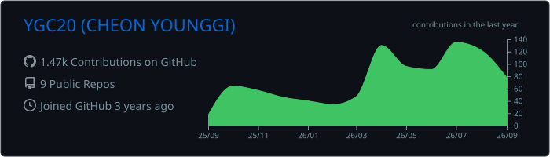
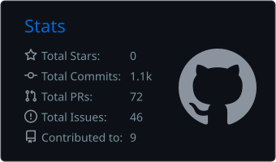
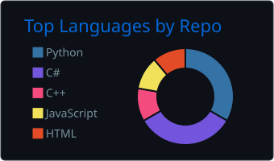
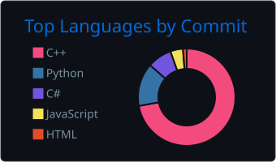

# Hi, I'm Cheon Young-Gi

  <h2 style="border-bottom: 1px solid #d8dee4; color: #282d33;">🎓 Education</h2>
   

  2019.03 - 2026.02 &nbsp;|&nbsp; 동아대학교 컴퓨터공학과

  2016.03 - 2019.02 &nbsp;|&nbsp; 금성고등학교

  <h2 style="border-bottom: 1px solid #d8dee4; color: #282d33;">🌐 External Activities</h2>
   

  2026.05.22 - 2026.11.27 &nbsp;|&nbsp; LIG The SSEN 임베디드 스쿨 4기 (수강중)

  2025.07.15 - 2025.07.17 &nbsp;|&nbsp; 2025 K-ICT WEEK in BUSAN

  2024.09.23 - 2025.03.19 &nbsp;|&nbsp; Google Developer Groups on Campus DAU

  <h2 style="border-bottom: 1px solid #d8dee4; color: #282d33;">🛠️ Tech Stacks</h2>

  <h2 style="border-bottom: 1px solid #d8dee4; color: #282d33;">🏅 Stats</h2>

