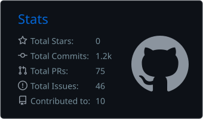

# Hi, I'm Cheon Young-Gi (천영기)

 

## 목차 (Table of Contents)

[🎓 Education](#-education) •
[🌐 Activities](#-activities) •
[🧰 Tech Stack](#-tech-stack) •
[📌 Major Projects](#-major-projects) •
[🔗 Links](#-links)

## Github Stats

 

 

## 🎓 Education

|    구분     | 기관                                                       |        기간         | 비고                                      |
| :---------: | :----------------------------------------------------------- | :------------------: | :----------------------------------------- |
| **교육** | LIG D&A The SSEN 임베디드 스쿨 4기                          | `2026.05 ~ 2026.11` | 수강중 · 최종 프로젝트: AESA 추적 레이더 데이터 처리부 개발 |
| **학력** | [동아대학교](https://computer.donga.ac.kr/) 컴퓨터공학과     | `2019.03 ~ 2026.02` | 학사 졸업                  |
| **학력** | 금성고등학교                                                | `2016.03 ~ 2019.02` |                                             |

## 🌐 Activities

|    구분     | 활동                                                       |        기간         | 비고                                      |
| :---------: | :----------------------------------------------------------- | :------------------: | :----------------------------------------- |
| **수상** | 동아대학교 D-STARTUP 창업 패키지 | – | 은상 (차량 번호판 인식 OCR 프로젝트) |
| **활동** | 2025 K-ICT WEEK in BUSAN 동아대 부스 운영                    | `2025.07.15 ~ 07.17` | 차량 번호판 인식(OCR) 프로그램 시연         |
| **활동** | Google Developer Groups on Campus DAU                       | `2024.09 ~ 2025.03` | 임베디드 스터디 참여, 지역 문제 해결 해커톤 기획 |

## 🧰 Tech Stack

### 💎 Main Skills

**Languages** :    
**AI & Vision** :      
**Backend & Web** :   
**Embedded** : -EE0000?style=flat-square&logo=xilinx&logoColor=white)   
**Data** :  
**Tools** :      

### 🌱 Currently Learning

**Languages & UI** :   -512BD4?style=flat-square&logo=dotnet&logoColor=white) 
**Embedded & Hardware** :  -FCC624?style=flat-square&logo=xilinx&logoColor=white)

## 📌 Major Projects

### 🛰️ Radar / Defense Embedded

|             프로젝트             | 한줄 요약                                                                          |         기간         |                       링크                        |
| :-------------------------------: | :---------------------------------------------------------------------------------- | :--------------------: | :------------------------------------------------: |
| **AESA 추적 레이더 데이터 처리부 개발** | LIG D&A The SSEN 임베디드SW 스쿨 최종 팀 프로젝트(5인, 멘토: LIG D&A 레이다연구소). 탐색·추적 등 여러 임무에 한정된 빔 시간을 배분하는 **빔 스케줄링 알고리즘 설계·구현** 담당. 요구사항 정의 → 유즈케이스 → 모듈 단위 시험이 가능한 구조로 개발하고, 완성한 처리부를 Zynq 보드에서 동작시키는 것이 목표 | `2026.09 ~ 2026.11 (진행중)` | [AESAlien](https://github.com/AESAlien/aesa-processor) |

### 🚗 Vision AI / OCR

|             프로젝트             | 한줄 요약                                                                          |         기간         |                       링크                        |
| :-------------------------------: | :---------------------------------------------------------------------------------- | :--------------------: | :------------------------------------------------: |
| **차량 번호판 인식 및 문자 탐지 프로그램** | 졸업작품(5인 팀) · 동아대 × 사하구청 현장미러형 연계협업. YOLOv5 탐지 → 투시 변환·CLAHE 전처리 → EasyOCR 2종 + Custom CRNN 병렬 인식 → 다수결·정규식 후처리. 100% 로컬 구동, 수작업 대비 처리속도 95% 단축 (1시간 36분 → 4분 18초, 385장 기준). D-STARTUP 은상 | `2025.03 ~ 2025.11` | [OCR](https://github.com/DAU-capstone-19/OCR) |

### 🤖 AIoT & Embedded

|     프로젝트      | 한줄 요약                                                                     |          기간           |                      링크                      |
| :----------------: | :------------------------------------------------------------------------------ | :-----------------------: | :---------------------------------------------: |
| **BoatControl** | 수면 쓰레기를 자율 수거하는 보트. 노트북(웹캠 + ONNX Runtime YOLOv10n)과 Zybo Z7-10(PetaLinux 2017.4)을 UDP로 연결하고, 모터·초음파 센서는 직접 작성한 리눅스 커널 캐릭터 드라이버(ioctl/IRQ)로 제어. 2026-09-26 실보드에서 부팅 → 커널 모듈 로드 → vision↔boat UDP 통신까지 검증 (센서·모터 실배선과 커스텀 모델 작업 진행 중) | `2024.04 ~ 2026.09 (진행중)` | [BoatControl](https://github.com/YGC20/BoatControl) |

### 🖥 Desktop Applications (C# / WPF)

|     프로젝트     | 한줄 요약                                                                | 기간                 |                     링크                     |
| :---------------: | :-------------------------------------------------------------------------- | :--------------------: | :---------------------------------------------: |
|  **tetrisStudy** | C++ 게임 로직 · C++/CLI 브릿지 · WPF/MVVM UI 3계층 구조 테트리스. 7-bag 랜덤, 벽킥 회전, DAS/ARR 키 반복 처리 직접 구현 (1인, 56커밋) | `2026.06 ~ 2026.08` |  [tetrisStudy](https://github.com/YGC20/tetrisStudy) |
|   **LookAtCat**  | OpenCV + dlib 얼굴 추적으로 웹캠 앞 사람의 시선을 따라 움직이는 WPF 캐릭터. 캡처·검출·렌더링 3스레드 분리와 Tracking/HoldLast/RandomWalk 상태머신 (1인, 15커밋) | `2026.08 ~ 2026.09` |   [LookAtCat](https://github.com/YGC20/LookAtCat) |

## 🔗 Links

 

**💬 원리로 완성을 증명하는 엔지니어**

